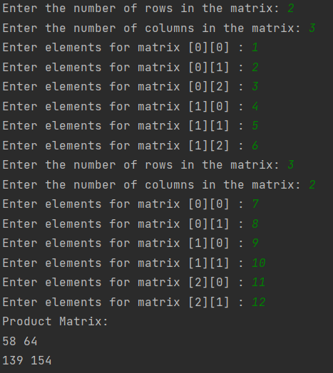
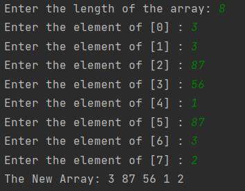
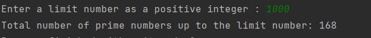
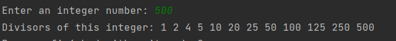
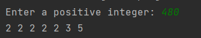

# Array Practices

### This repository is created to improve my knowledge arrays.

---

## Details
* This repository has
    * a MatrixMultiplication.java class that takes two matrices from the user, multiplies them and prints the answer 
    on the terminal. For matrix multiplication, the number of columns in the first matrix must be equal to the number 
    of rows in the second matrix.

    

    * a CopyArrayElements.java class that copies elements from one array to another without any sorting operations, 
    and copies the duplicate elements only once.

    

    * a SieveOfEratosthenes.java class that finds all prime numbers up to any given limit by using Sieve of Eratosthenes
    algorithm. To more information, please [visit the link.](https://en.wikipedia.org/wiki/Sieve_of_Eratosthenes)
  
    

    * a DivisorsOfAnInteger.java class that calculates divisors of an integer number. A divisor of an integer number is
    a number which divides number without remainder.
  
    

    * a PrimeFactorizationTheorem.java class that calculates prime factors (or divisors) of an integer number.
    In mathematics, the fundamental theorem of arithmetic, also called the unique factorization theorem and prime 
    factorization theorem, states that every integer greater than 1 can be represented uniquely as a product of prime
    numbers, up to the order of the factors. To more information, please [visit the link.](https://en.wikipedia.org/wiki/Fundamental_theorem_of_arithmetic)
   
    

    * Stack.java and StackTest.java classes that describes the working logic of stack.

---

## Installation
Clone the project.
> https://github.com/aslihanhasar/up-school-practices.git

---

## Usage
After cloning the project, open it with the ide you used.

---

## Requirements
* JDK (version 17 is recommended)

---

## Author
**Aslıhan Hasar**

* GitHub: [aslihanhasar](https://github.com/aslihanhasar)
* LinkedIn: [aslıhanhasar](https://www.linkedin.com/in/asl%C4%B1hanhasar
  )
---

## Contributing
Contributions, issues, and feature requests are welcome.

---

## License

[MIT](https://choosealicense.com/licenses/mit/)

---

## Show Your Suport
Give me a &#11088; if you like the project.

---

## Acknowledgments
* This repo is created for assignments in Introduction to Object-Oriented Programming with Java course given by Akın
Kaldıroğlu at Udemy.
