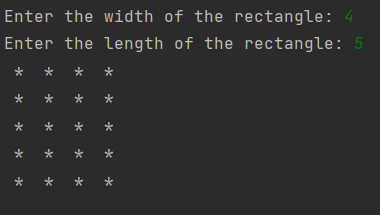
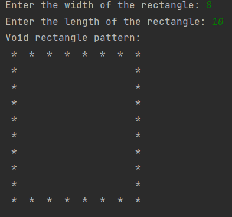
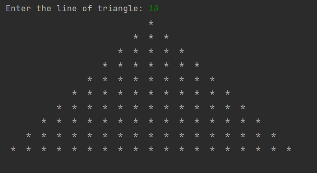
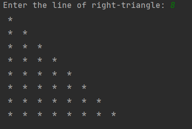
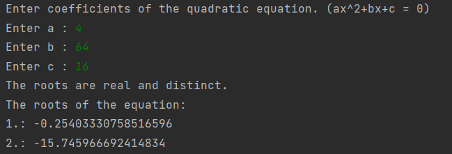
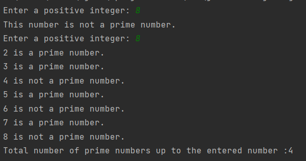
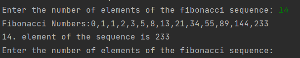

# Flow Control Practices

### This repository is created to improve my knowledge control structures and loops.

---

## Details

* This repository has
    * a RectangleStarPattern.java class in which filled and empty rectangle shapes
      are created using stars and printed on the terminal.

        * Filled Rectangle Pattern

          

        * Empty Rectangle Pattern

          

    * a TriangleStarPattern.java class in which triangle shapes are created using stars and printed on the terminal.
      methods are defiined.

      

    * a RightTriangleStarPattern.java class in which right triangle shapes are created using stars and printedon the
      terminal.

      

    * RootsOfQuadraticEquations.java class that calculates the roots of a quadratic equation of the form ax^2+bx+c = 0

      

    * FizzBuzzGame.java class that contains a small scale game in which any number divisible by three is replaced by the
      word Fizz and any number divisible by five by the word Buzz.
      Numbers divisible by both three and five become FizzBuzz.

    * PrimeNumbers.java class that checks whether the entered number is a prime number and the numbers up to the entered
      number and finds the total prime number.

      

    * FibonacciNumbers.java class that prints the fibonacci numbers according to the number of elements taken from user
      and gives the fibonacci number of this element.

      

    * MonteCarloPi.java class that estimates the value of Pi using Monte Carlo.

      

---

## Installation

Clone the project.
> https://github.com/aslihanhasar/up-school-practices.git

---

## Usage

After cloning the project, open it with the ide you used.

---

## Requirements

* JDK (version 17 is recommended)

---

## Author

**Aslıhan Hasar**

* GitHub: [miyendisa](https://github.com/aslihanhasar)
* LinkedIn: [aslıhanhasar](https://www.linkedin.com/in/asl%C4%B1hanhasar
  )

---

## Contributing

Contributions, issues, and feature requests are welcome.

---

## License

[MIT](https://choosealicense.com/licenses/mit/)

---

## Show Your Suport

Give me a &#11088; if you like the project.

---

## Acknowledgments

* This repo is created for assignments in Introduction to
  Object-Oriented Programming with Java course given by Akın Kaldıroğlu at Udemy.
